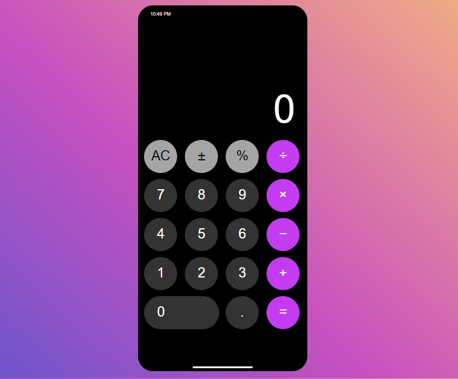

# Calculadora para iPhone

Este é um projeto de uma calculadora simples desenvolvida para ser semelhante à calculadora do iPhone.

## Descrição

Esta calculadora é uma implementação simples de uma calculadora básica com funcionalidades de soma, subtração, multiplicação, divisão e outras operações matemáticas básicas. Ela também inclui botões para limpar o visor, mudar o sinal do número exibido, calcular a porcentagem e muito mais.

## Como Usar

1. Abra o arquivo `index.html` em um navegador da web.
2. Use os botões na calculadora para inserir números e realizar operações.
3. O visor mostrará o resultado das operações conforme você as realiza.

## Recursos

- Interface amigável, inspirada na calculadora do iPhone.
- Funcionalidades básicas de uma calculadora, como soma, subtração, multiplicação e divisão.
- Botões adicionais para operações extras, como limpar o visor e calcular a porcentagem.
- Atualização automática do horário exibido na calculadora.
- Estilo de design moderno e atraente.

## Tecnologias Utilizadas

- HTML5
- CSS3
- JavaScript

## Créditos

Este projeto foi desenvolvido por [IsmaelMoreira].

---
